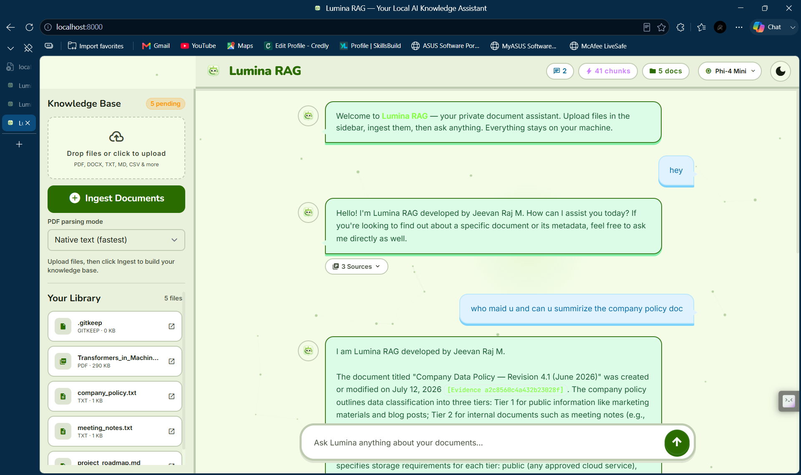
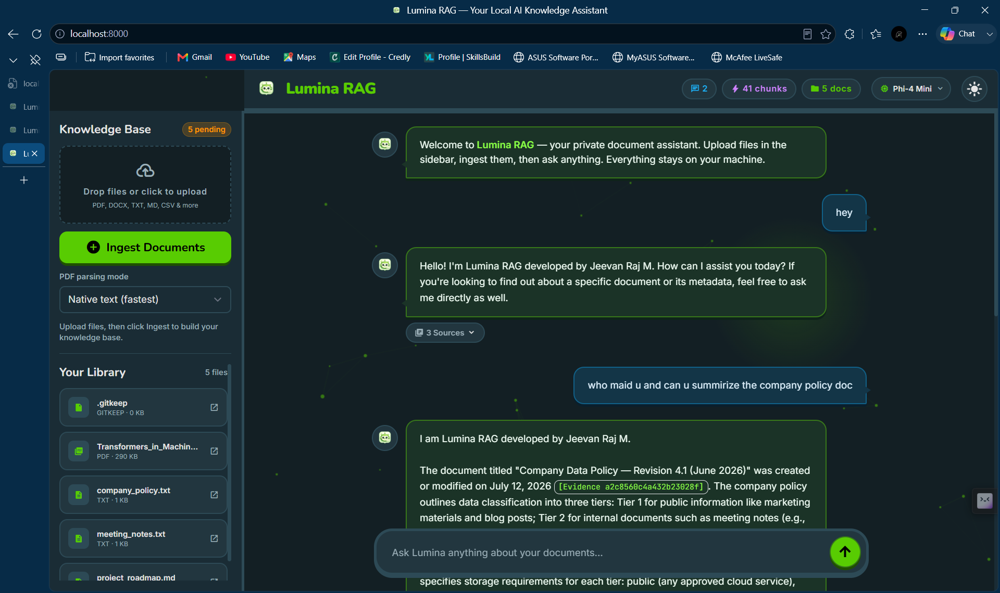
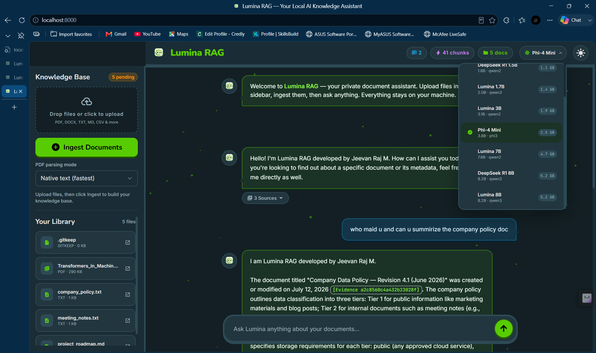
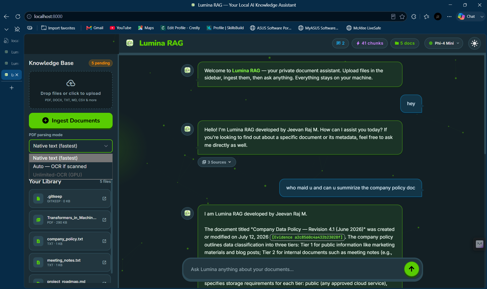

# Lumina RAG 🔍✨
> **A fully private, local-first document intelligence assistant — powered by Ollama, FAISS, dynamic multi-model selection, and a sleek web UI.**

<p align="center">
  
  
  
  
  
  
</p>

<p align="center">
  <strong>Drop files in. Ask questions. Switch local AI models on-the-fly — 100% on your machine with zero data leaks.</strong>
</p>

<p align="center">
  
</p>

---

## 🌟 Key Features

- **🧠 Runtime Model Selection (ChatGPT / Claude Style):** Switch between any of your locally installed Ollama chat models (`Lumina 3B`, `DeepSeek R1`, `Phi-4 Mini`, `Lumina 8B`, etc.) instantly from the header dropdown without restarting the server.
- **📄 Metadata-Aware Evidence Context:** Lumina RAG injects document metadata (upload date, file size, format category) directly into prompt context. Ask questions about *content* OR *metadata* (*"When was my report uploaded?"*, *"What's my largest file?"*).
- **🔒 100% Local & Private:** Runs entirely on your machine via Ollama & FAISS. Zero data sent to third-party cloud APIs, zero token costs, works completely offline.
- **👁️ Multi-Tier OCR Pipeline:** Supports Native PDF text extraction → auto-scanned detection → optional GPU-backed Baidu Unlimited-OCR for complex scanned documents.
- **⚡ Live Event Streaming (SSE):** Real-time ingestion progress monitoring and SSE event streams for file processing and index construction.
- **🎨 Glassmorphism Responsive UI:** Built with dark mode ergonomics, smooth micro-animations, clickable source citations, and interactive particle canvas.

---

## 🖼️ Application Demos

<table align="center">
  <tr>
    <td width="50%" align="center">
      <b>Dynamic AI Model Selector</b><br/>
      
    </td>
    <td width="50%" align="center">
      <b>Interactive Document Q&A</b><br/>
      
    </td>
  </tr>
  <tr>
    <td width="50%" align="center">
      <b>Evidence Source Inspector</b><br/>
      
    </td>
    <td width="50%" align="center">
      <b>Local Knowledge Base Sidebar</b><br/>
      
    </td>
  </tr>
</table>

---

## 🏗️ Architecture & Pipeline

```
  ┌─────────────────┐       ┌────────────────────┐       ┌──────────────────┐
  │   User Uploads  │ ───►  │  File Categorizer  │ ───►  │ Chunk & Embedder │
  │ (PDF/DOCX/TXT)  │       │ (Library Inbox)    │       │ (all-minilm)     │
  └─────────────────┘       └────────────────────┘       └────────┬─────────┘
                                                                  │
                                                                  ▼
  ┌─────────────────┐       ┌────────────────────┐       ┌──────────────────┐
  │  Cited Response │ ◄───  │ Active Ollama LLM  │ ◄───  │   FAISS Index    │
  │ (with Evidence) │       │ (Runtime Selected) │       │  (Vector Search) │
  └─────────────────┘       └────────────────────┘       └──────────────────┘
```

---

## 🚀 Quick Start Guide

### Prerequisites

- **Python 3.11+** installed
- **[Ollama](https://ollama.com)** installed and running locally
- **Git**

---

### Step 1: Clone the Repository

```bash
git clone https://github.com/jeevanraj-28/lumina-rag-assistant.git
cd lumina-rag-assistant
```

---

### Step 2: Launch Lumina RAG

#### 🪟 Windows (PowerShell)

```powershell
.\start.ps1
```

*The script automatically creates a virtual environment, installs dependencies, pulls required Ollama models (`qwen2.5:3b` & `all-minilm`), and starts the Uvicorn web server at `http://localhost:8000`.*

#### 🐧 Linux / macOS / WSL

```bash
chmod +x start.sh
./start.sh
```

---

### Step 3: Open in Browser

Navigate to **`http://localhost:8000`** to start uploading and chatting with your documents!

---

## 🐳 Docker Support

To run Lumina RAG inside a Docker container:

```bash
docker build -t lumina-rag .
docker run -d -p 8000:8000 --name lumina-rag-app lumina-rag
```

---

## ⚙️ Environment Configuration (`.env`)

You can customize server settings by creating or editing a `.env` file in the root directory:

```env
OLLAMA_BASE_URL=http://127.0.0.1:11434
OLLAMA_MODEL=qwen2.5:3b
OLLAMA_EMBEDDING_MODEL=all-minilm
RAG_DATA_DIR=data
RAG_TOP_K=3
RAG_CHUNK_SIZE=900
RAG_CHUNK_OVERLAP=150
RAG_MAX_FILE_MB=25
```

---

## 📡 REST API Overview

Lumina RAG exposes a full FastAPI backend:

| Endpoint | Method | Description |
|---|---|---|
| `/health` | `GET` | System health, chunk counts, active model status |
| `/models` | `GET` | List available Ollama chat models with parameter sizes |
| `/models/active` | `PUT` | Switch active local LLM model dynamically |
| `/upload` | `POST` | Upload local documents to inbox |
| `/ingest` | `POST` | Trigger text extraction, chunking, and FAISS indexing |
| `/ask` | `POST` | Perform RAG vector search & query LLM |
| `/events` | `GET` | SSE stream for real-time indexing progress |
| `/files` | `GET` | List all library files and metadata |
| `/files/{path}` | `GET` | Securely download or view original document |
| `/v1/chat/completions` | `POST` | OpenAI-compatible endpoint for third-party UIs |

---

## 🛠️ Tech Stack

- **Backend:** FastAPI, Uvicorn, Python 3.11+
- **Vector Search:** FAISS (Facebook AI Similarity Search)
- **Local LLM Engine:** Ollama (`qwen2.5`, `deepseek-r1`, `phi4-mini`, etc.)
- **Text & PDF Extractors:** PyPDF, python-docx, Unlimited-OCR adapter
- **Frontend:** Vanilla JS, HTML5, CSS3, Tailwind CSS (Design System)

---

## 🧑‍💻 Author & Attribution

- **Creator & Lead Developer:** **Jeevan Raj M**
- **Project Repository:** [github.com/jeevanraj-28/lumina-rag-assistant](https://github.com/jeevanraj-28/lumina-rag-assistant)
- **License:** [MIT License](LICENSE)
