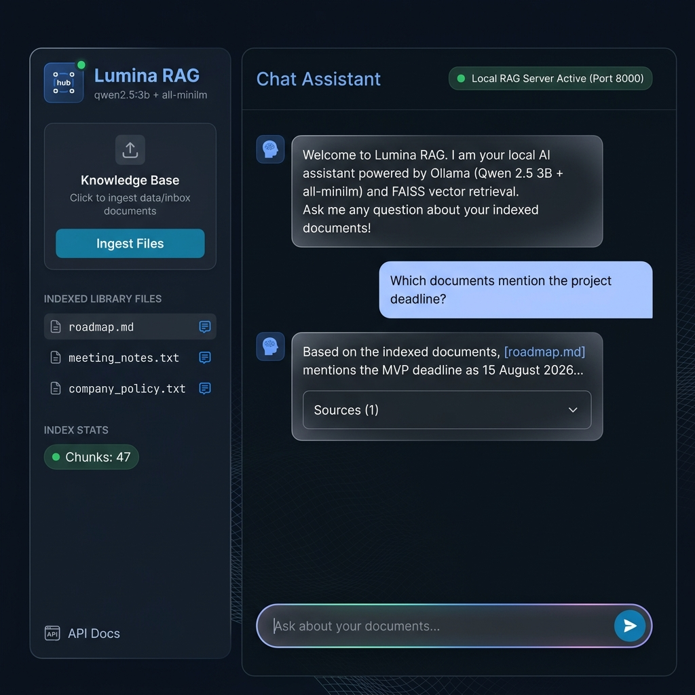

# Lumina RAG 🔍✨
> **A fully private, local-first document intelligence assistant — powered by Ollama, FAISS, and a beautiful web UI.**

<p align="center">
  
  
  
  
  
  
</p>

<p align="center">
  <strong>Drop files in. Ask questions. Get answers — 100% on your machine, zero cloud, zero data leaks.</strong>
</p>

<p align="center">
  
</p>

---

## ✨ What is Lumina RAG?

Lumina RAG turns any folder of documents into a private, conversational knowledge base. Upload PDFs, Word docs, Markdown notes, code files, CSVs and more — then ask natural language questions and get accurate, cited answers without any of your data leaving your machine.

```
flowchart:
  📁 data/inbox  ──▶  POST /ingest  ──▶  FAISS Index
       📂 Organize by type (pdf / word / data / web / other)
       ✂️  Chunk + embed with all-minilm (46 MB)

  💬 Question  ──▶  FAISS semantic search  ──▶  Top-K chunks
       🤖 Ollama: Qwen 2.5 3B  ──▶  Cited answer
```

### Why Lumina RAG?
| Feature | Lumina RAG | Cloud RAG APIs |
|---|---|---|
| Data privacy | ✅ 100% local | ❌ Sent to third party |
| API key needed | ✅ None | ❌ Required |
| Works offline | ✅ Fully offline | ❌ Needs internet |
| Model cost | ✅ Free | ❌ Per-token billing |
| GPU required | ✅ No (CPU works) | — |

---

## 🚀 Quick Start

### Prerequisites
- [Python 3.11+](https://python.org)
- [Ollama](https://ollama.com/) installed and in `PATH`
- `git` (to clone this repo)

### 1 — Clone & launch with one command

```bash
git clone https://github.com/jeevanraj-28/lumina-rag-assistant.git
cd lumina-rag-assistant
bash start.sh
```

The startup script will automatically:
- Copy `.env.example` → `.env` on first run
- Create and activate a Python virtual environment
- Install all Python dependencies
- Start the Ollama server (if not already running)
- Pull `qwen2.5:3b` (≈1.9 GB) and `all-minilm` (46 MB) on first run
- Launch the FastAPI server at **http://localhost:8000**
- Open your browser automatically

### Startup flags

```bash
bash start.sh --rebuild       # Force a full FAISS index rebuild on startup
bash start.sh --no-browser    # Skip auto-opening the browser
bash start.sh --rebuild --no-browser
```

---

## 🐳 Docker (alternative)

```bash
# CPU
docker build -t lumina-rag .
docker run --rm -p 8000:8000 -v "${PWD}/data:/app/data" lumina-rag

# NVIDIA GPU
docker run --rm --gpus all -p 8000:8000 -v "${PWD}/data:/app/data" lumina-rag
```

> On first run, models are downloaded into `data/ollama-models/` which is bind-mounted, so subsequent runs are instant.

---

## 📂 Project Structure

```
lumina-rag-assistant/
├── app/
│   ├── main.py              # FastAPI application — all routes & RAG logic
│   └── static/
│       └── index.html       # Full-featured browser chat UI (Lumina Dashboard)
├── data/
│   ├── inbox/               # 📥 Drop your documents here
│   ├── library/             # 📚 Auto-organised by file type after ingestion
│   ├── index/               # 🗂️  FAISS index + metadata (auto-generated)
│   └── ollama-models/       # 🤖 Ollama model cache (Docker / local)
├── .env.example             # All configurable settings
├── Dockerfile               # Production container
├── docker-entrypoint.sh     # Container startup logic
├── requirements.txt         # Python dependencies
└── start.sh                 # ⚡ One-shot local startup script
```

---

## 💬 Using the App

1. **Drop files** into `data/inbox/` (PDF, DOCX, TXT, MD, CSV, JSON, HTML, code files)
2. Click **"Knowledge Base"** in the sidebar (or call `POST /ingest`) to index them
3. **Ask questions** in the chat — answers include cited source filenames and excerpts

### Supported file formats
`PDF` · `DOCX` · `TXT` · `Markdown` · `CSV` · `JSON` · `HTML` · `Python` · `JavaScript` · `TypeScript` · `Java` · `Go` · `Rust` · `YAML`

> ⚠️ Files larger than 25 MB are skipped by default. Adjust `RAG_MAX_FILE_MB` in `.env` to change this limit.

---

## ⚙️ Configuration

Copy `.env.example` to `.env` and edit as needed:

```dotenv
OLLAMA_BASE_URL=http://127.0.0.1:11434   # Ollama server address
OLLAMA_MODEL=qwen2.5:3b                  # LLM for answer generation
OLLAMA_EMBEDDING_MODEL=all-minilm        # Embedding model (46 MB, fast)
RAG_DATA_DIR=data                        # Root data directory
RAG_TOP_K=3                              # Chunks retrieved per query
RAG_CHUNK_SIZE=900                       # Characters per chunk
RAG_CHUNK_OVERLAP=150                    # Overlap between chunks
RAG_MAX_FILE_MB=25                       # Max file size to index
```

### Lighter / heavier model options

| Model | Size | When to use |
|---|---|---|
| `qwen2.5:1.5b` | ~1 GB | Low-RAM machines (< 8 GB) |
| `qwen2.5:3b` *(default)* | ~1.9 GB | Good balance on 8 GB+ |
| `llama3.2:3b` | ~2 GB | Alternative CPU-friendly option |

---

## 🔌 API Reference

All endpoints are also available at **http://localhost:8000/docs** (Swagger UI).

### `GET /health`
Returns server status, active model, and indexed chunk count.

### `POST /ingest`
```json
{ "rebuild": false }
```
Scans `data/inbox/`, organises files into `data/library/`, and (re)builds the FAISS index.

### `POST /ask`
```json
{ "question": "Which documents mention the project deadline?", "top_k": 5 }
```
**Response:**
```json
{
  "answer": "The roadmap lists the MVP deadline as 15 August...",
  "sources": [
    { "file": "text/roadmap.md", "category": "text", "excerpt": "...", "score": 0.91 }
  ]
}
```

### `GET /files` · `GET /files/{path}`
Browse and download files from the organised library.

### OpenAI-compatible endpoint (`POST /v1/chat/completions`)
Point any OpenAI-compatible client (e.g., [Open WebUI](https://openwebui.com/)) at `http://localhost:8000/v1` and select model `local-rag`.

---

## 🛡️ Privacy & Security

- **Everything runs locally** — embeddings, retrieval, and generation never leave your machine.
- The app only passes retrieved text chunks to the local Ollama service.
- No telemetry, no analytics, no cloud calls.
- Scanned / image-only PDFs require OCR pre-processing (text-based PDFs work out of the box).

---

## 📊 Resource Profile

| Component | Download size | RAM usage |
|---|---|---|
| `qwen2.5:3b` (default LLM) | ~1.9 GB | ~4 GB |
| `all-minilm` (embeddings) | 46 MB | minimal |
| FAISS index (typical personal doc set) | < 50 MB | < 200 MB |

> **Low-RAM tip:** Set `OLLAMA_MODEL=qwen2.5:1.5b` in `.env` for machines with less than 8 GB RAM.

---

## 🤝 Contributing

Pull requests are welcome! Please open an issue first to discuss major changes.

1. Fork the repo
2. Create a feature branch (`git checkout -b feature/my-feature`)
3. Commit your changes (`git commit -m 'Add my feature'`)
4. Push to the branch (`git push origin feature/my-feature`)
5. Open a Pull Request

---

## 📄 License

Distributed under the **MIT License**. See `LICENSE` for more information.

---

<p align="center">
  Built with ❤️ · Powered by <a href="https://ollama.com/">Ollama</a>, <a href="https://github.com/facebookresearch/faiss">FAISS</a>, and <a href="https://fastapi.tiangolo.com/">FastAPI</a>
</p>
